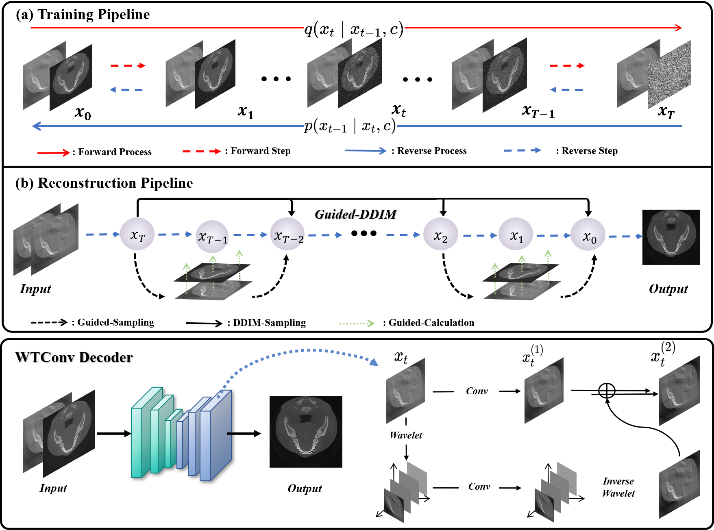

# Paper Title: 
PWD: Prior-aware Wavelet Diffusion for Efficient Dental Limited-angle CT Reconstruction

## Author(s)
Yi Liu, Yiyang Wen, Zekun Zhou, Junqi Ma, Linghang Wang, Yucheng Yao, Liu Shi, Qiegen Liu, Senior Member, IEEE

## Publication Information
[https://arxiv.org/abs/2511.14310](https://arxiv.org/abs/2507.05317)

---

## Paper Structure and Experimental Results

The figure below illustrates the overall framework of the paper and key experimental results:

## 🏗️ Project Structure
---

├── CT_rec_lib/ # CT reconstruction library (FP / BP operators)

├── guided_diffusion/ # Diffusion model implementation

├── limited_IMG_train.py # Training script

├── limited_IMG_sample.py # Sampling / inference script

### 📂 Module Description

- **CT_rec_lib**  
  Provides forward projection (FP) and back projection (BP) tools for CT reconstruction.

- **guided_diffusion**  
  Core implementation of the diffusion model, including network architecture, training, and sampling logic.

- **limited_IMG_train.py**  
  Main training entry point.

- **limited_IMG_sample.py**
  Used for reconstruction (sampling) from trained models.
  
-  **guided_diffusion/image_datasets.py**
  Used for reconstruction (sampling) from trained models.
  Prepare your CT projection or reconstruction dataset
  Modify dataset configuration in:
---
